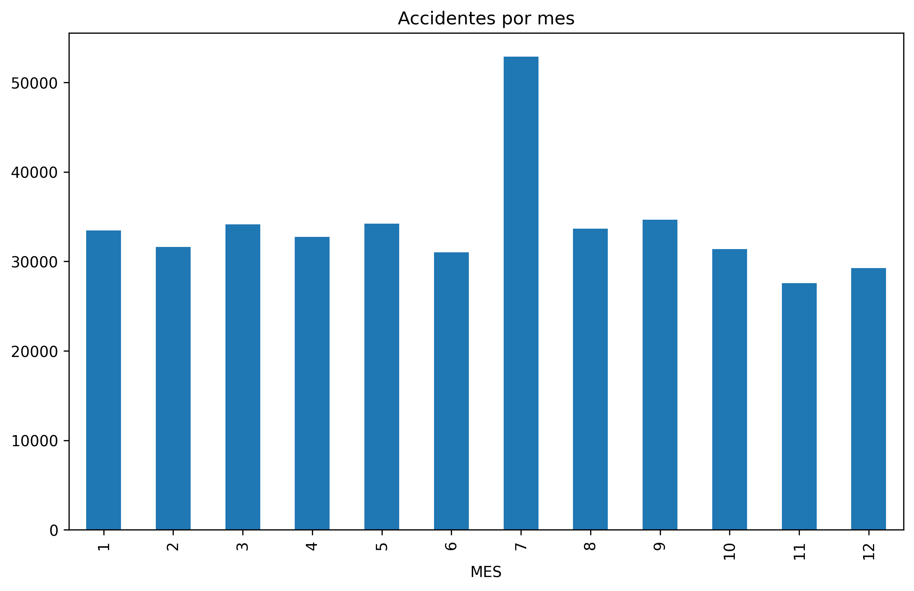
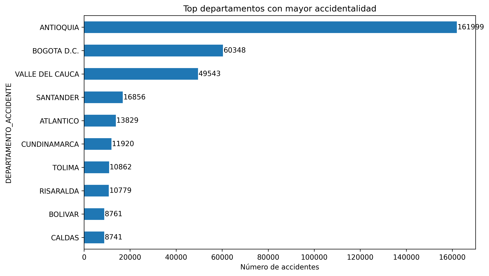
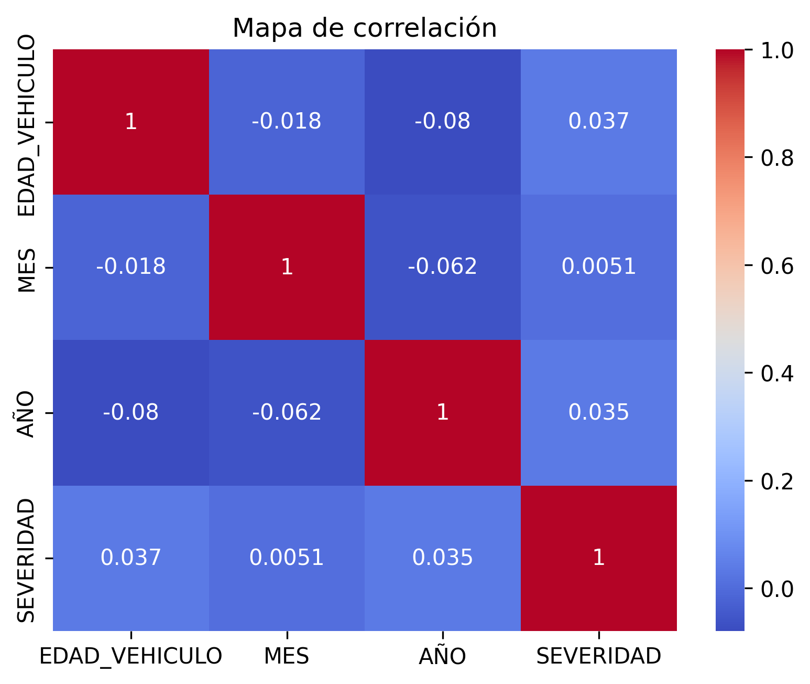
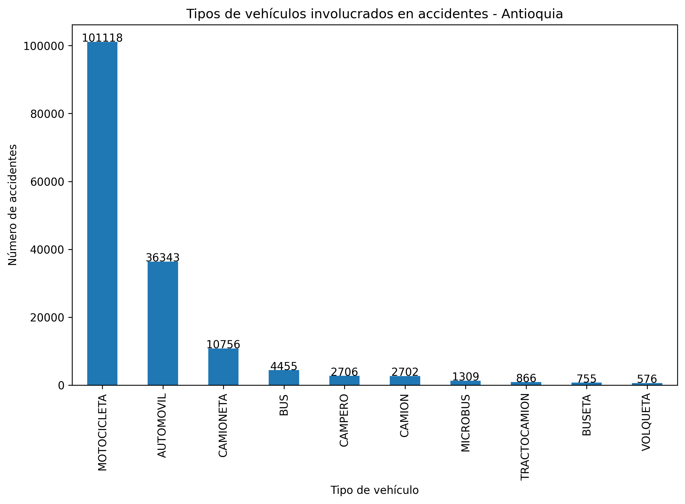

# 🚧 Análisis y Predicción de la Severidad en Accidentes de Tránsito en Colombia

Proyecto de analítica de datos y machine learning orientado a la identificación de patrones de accidentalidad vial y la predicción de la severidad de los siniestros, con un enfoque específico en el departamento de Antioquia.

---

## 🎯 Objetivo

Desarrollar un modelo de aprendizaje automático capaz de predecir la severidad de accidentes de tránsito en Colombia, mediante el uso de técnicas de análisis exploratorio de datos (EDA), procesos ETL y modelado supervisado.

---

## 📌 Alcance del Proyecto

- Análisis exploratorio de datos a nivel nacional  
- Enfoque específico en el departamento de Antioquia  
- Construcción de indicadores de accidentalidad  
- Desarrollo de modelos predictivos (Random Forest)  
- Implementación de dashboard interactivo en Power BI  
- Generación de mapas de calor por departamento y municipio  

---

## 🧱 Estructura del Proyecto

📁 data/
   ├── raw/
   ├── processed/
   ├── external/

📁 notebooks/
   ├── 01_data_understanding.ipynb
   ├── 02_eda.ipynb
   ├── 03_modeling.ipynb

📁 models/
   ├── modelo_colombia.pkl
   ├── modelo_antioquia.pkl

📁 outputs/
   ├── feature_importance.csv
📁 src
   ├──etl.py
   ├──features.py
   ├──utils.py
📁 dashboard/
📁 api/
📄 requirements.txt
📄 README.md


---

## ⚙️ Tecnologías Utilizadas

- Python  
- Pandas, NumPy  
- Scikit-learn  
- Imbalanced-learn (SMOTE)  
- Matplotlib  
- FastAPI  
- Power BI  

---

## 🔄 Flujo del Proyecto

1. Carga de datos originales (dataset de accidentalidad)  
2. Limpieza y transformación de datos (ETL)  
3. Creación de variables (MES, AÑO, SEVERIDAD)  
4. Análisis exploratorio de datos (EDA)  
5. Modelado predictivo  
6. Evaluación del modelo  
7. Visualización en Power BI  
8. Implementación de API para predicción  

---

## 🧠 Metodología

El proyecto se desarrolla bajo un enfoque híbrido basado en:

- **CRISP-DM**, orientado al proceso de ciencia de datos  
- **AUP (Agile Unified Process)**, para organización iterativa del desarrollo  

Fases implementadas:

1. Comprensión del negocio  
2. Comprensión de los datos  
3. Preparación de los datos (ETL)  
4. Modelado  
5. Evaluación  
6. Visualización  

---

## 🤖 Modelo Predictivo

Se implementó un modelo de clasificación basado en Random Forest, integrando:

- Preprocesamiento con ColumnTransformer  
- Codificación OneHot para variables categóricas  
- Escalado de variables numéricas  
- Balanceo de clases mediante SMOTE  

Se desarrollaron dos modelos:

- Modelo general para Colombia  
- Modelo específico para Antioquia (nivel municipal)  

---

## 📊 Resultados

- Identificación de variables relevantes en la severidad de los accidentes  
- Generación de mapas de calor a nivel nacional y departamental  
- Construcción de indicadores como tasa de severidad  
- Modelo predictivo con desempeño aceptable  
- Dashboard interactivo para análisis dinámico  

---

## 🚀 API de Predicción

El proyecto incluye una API desarrollada en FastAPI para realizar predicciones en tiempo real.

## 📊 Visualización

El dashboard desarrollado en Power BI permite:

Analizar KPIs de accidentalidad
Identificar patrones temporales
Evaluar la severidad por región
Explorar datos a nivel de municipio en Antioquia





📌 Conclusión

El proyecto evidencia cómo la aplicación de técnicas de analítica de datos y aprendizaje automático permite transformar datos históricos en información estratégica.

Los resultados obtenidos muestran que es posible apoyar la toma de decisiones en seguridad vial mediante modelos predictivos y herramientas de visualización.

📂 Datos
El dataset no se incluye en el repositorio debido a su tamaño
Puede descargarse desde Datos Abiertos Colombia:

https://www.datos.gov.co/Transporte/VEHICULOS-INVOLUCRADOS-EN-UN-ACCIDENTE-DE-TRANSITO/6jmc-vaxk/about_data

### ▶️ Ejecutar API

```bash
uvicorn main:app --reload


 ## ⚙️ ENDPOINT

 POST /predict


## 📊 EJEMPLO 1 Colombia

{
  "region": "colombia",
  "TIPO_VEHICULO": "MOTO",
  "EDAD_VEHICULO": 5,
  "AÑO": 2023,
  "MES": 12,
  "DEPARTAMENTO_ACCIDENTE": "ANTIOQUIA"
}


## 📊 EJEMPLO 2 Antioquia
{
  "region": "antioquia",
  "TIPO_VEHICULO": "MOTO",
  "AÑO": 2023,
  "MES": 12,
  "MUNICIPIO_ACCIDENTE": "MEDELLIN"
}


Cómo Ejecutar el Proyecto
Clonar repositorio
git clone https://github.com/carlos-ortega-villa/analisis-accidentalidad-colombia.git
Crear entorno virtual
python -m venv venv
Activar entorno
venv\Scripts\activate
Instalar dependencias
pip install -r requirements.txt
Ejecutar notebooks o API

Autor

Carlos Alberto Ortega Villa
Estudiante de Ingeniería de Sistemas
Universidad Popular del Cesar